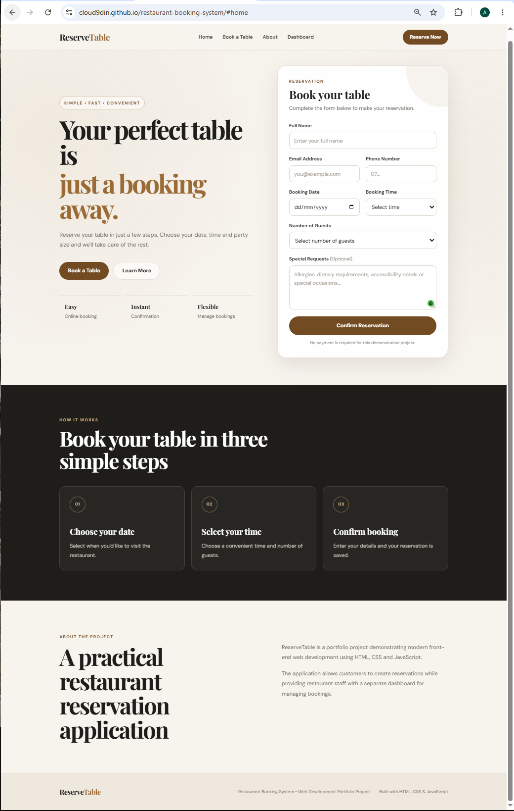
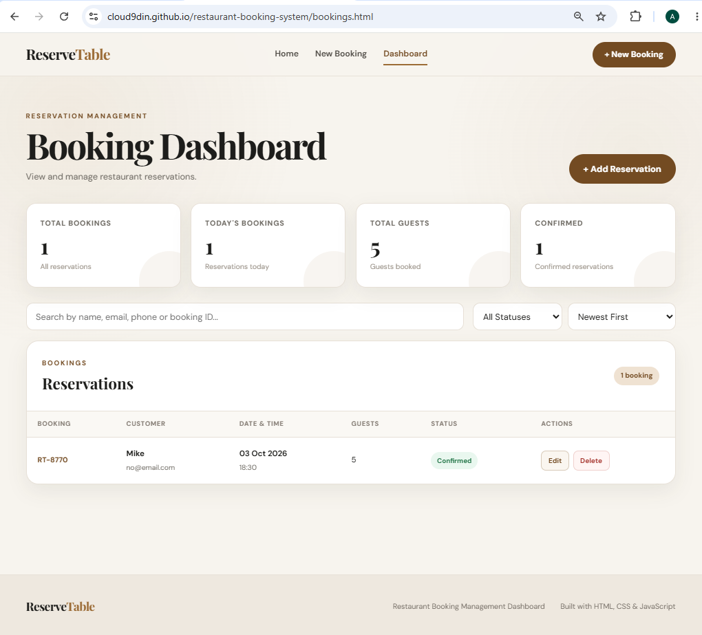

# 🍽️ ReserveTable — Restaurant Booking System

A modern and responsive restaurant reservation application built with **HTML, CSS and JavaScript**.

ReserveTable allows customers to create restaurant reservations and provides a separate booking management dashboard where reservations can be searched, filtered, edited, cancelled and deleted.

This project was created as part of my web development portfolio to demonstrate practical front-end development skills and JavaScript DOM manipulation.

---

## 🌐 Live Demo

[ View Live Project](https://cloud9din.github.io/restaurant-booking-system/)

## 📸 Screenshots

### Reservation Page

The customer-facing reservation page allows users to select a date, time, number of guests and provide their contact details.



### Booking Management Dashboard

The management dashboard displays reservation statistics and allows bookings to be searched, filtered, edited, cancelled and deleted.


## ✨ Features

### Customer Booking

- Responsive restaurant booking form
- Customer name, email and phone number
- Booking date selection
- Booking time selection
- Number of guests
- Special requests and dietary information
- Prevents selection of past dates
- Form validation
- Automatic booking reference generation
- Reservation confirmation message
- Mobile-friendly navigation

### Booking Management Dashboard

- View all restaurant reservations
- Total booking statistics
- Today's booking count
- Total guest count
- Confirmed booking count
- Search reservations
- Filter by booking status
- Sort reservations by:
  - Newest booking
  - Reservation date
  - Customer name
- Edit existing reservations
- Change booking status
- Cancel reservations
- Delete reservations
- Confirmation modal before deletion
- Responsive dashboard design

---

## 🛠️ Technologies Used

- **HTML5** — page structure and semantic markup
- **CSS3** — responsive design, layouts and styling
- **JavaScript** — application functionality and DOM manipulation
- **LocalStorage** — browser-based reservation storage
- **Git & GitHub** — version control and project hosting
- **GitHub Pages** — live project deployment

---

## 💻 Application Flow

The application follows this simple booking process:

```text
Customer Booking Form
        ↓
Form Validation
        ↓
Create Booking Object
        ↓
Generate Booking Reference
        ↓
Save to LocalStorage
        ↓
Display Confirmation
        ↓
Booking Dashboard
        ↓
Search / Filter / Edit / Cancel / Delete


---

## 📁 Project Structure

```text
restaurant-booking-system/
├── index.html
├── bookings.html
├── style.css
├── script.js
├── bookings.js
├── booking-page.png
├── dashboard.png
└── README.md
```

---

## 💾 Data Storage

The application uses browser **LocalStorage** to store reservation data.

Bookings remain available after the page is refreshed, but the data is stored only in the browser and device where the reservation was created.

---

## 🎯 What I Learned

This project helped me improve my skills in:

- HTML5 and semantic page structure
- Responsive CSS design
- JavaScript DOM manipulation
- Form validation
- JavaScript objects and arrays
- LocalStorage and JSON
- Search and filtering
- Sorting data
- Editing and deleting stored records
- Creating modal windows
- Building responsive management dashboards
- Git and GitHub version control

---

## 🔮 Future Improvements

Future versions could include:

- Database integration
- Firebase or backend API
- Secure staff login
- Email booking confirmations
- Table availability checking
- Real-time reservation management
- Customer cancellation links


## 📌 Project Status

**Working Version**

- Customer reservations ✅
- Form validation ✅
- Booking references ✅
- LocalStorage ✅
- Management dashboard ✅
- Search and filtering ✅
- Sorting ✅
- Edit reservations ✅
- Cancel reservations ✅
- Delete reservations ✅
- Responsive design ✅

---

## 👨‍💻 Developer

**Abu Lashkor**

GitHub: **Cloud9din**

Built as part of my web development portfolio using **HTML, CSS and JavaScript**.

---
